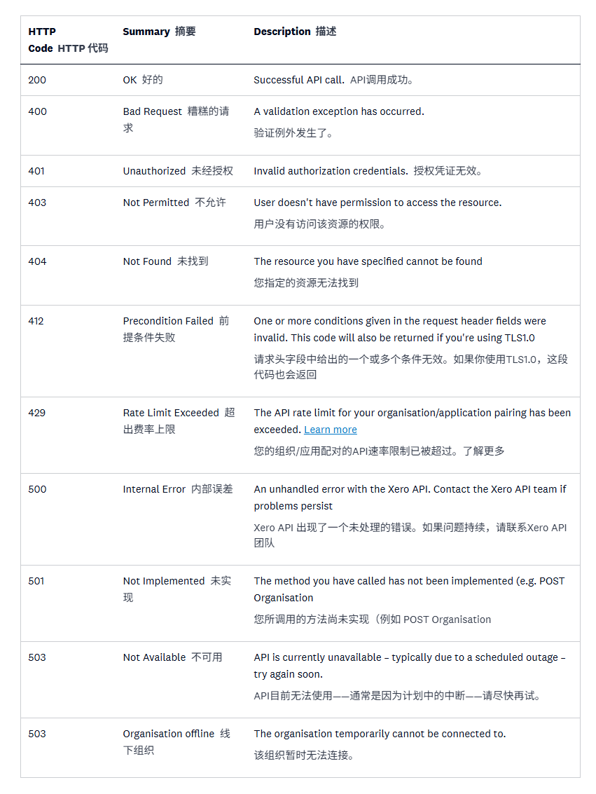

# C. API questions

## Scenario questions

### C1. How would you prove that our Xero API connection is working before checking invoices? 在检查发票之前，如何证明我们的 Xero API 连接是正常的？


Answer / 答案：
通过调用 POST https://api.xero.com/bankfeeds.xro/1.0/FeedConnections 接口来处理
This is handled by calling the POST API at https://api.xero.com/bankfeeds.xro/1.0/FeedConnections.

```
POST https://api.xero.com/bankfeeds.xro/1.0/FeedConnections
```

> 返回的结果会存在连接状态status来分析当前的链接是否正常
> The returned results will include a connection status indicator to analyze whether the current connection is functioning correctly.

请求体
Request body

```
{
  "items": [
    {
      "accountToken": "10000123",
      "accountNumber": "3809087654321500",
      "accountName": "Joe's Savings Account",
      "accountType": "BANK",
      "currency": "AUD"
    },
    {
      "accountToken": "10000124",
      "accountNumber": "1234",
      "accountName": "Sam's Credit Card",
      "accountType": "CREDITCARD",
      "currency": "AUD"
    },
    {
      "accountToken": "10000125",
      "accountNumber": "3809087654321501",
      "accountName": "Lu’s Current Account",
      "accountType": "BANK",
      "currency": "AUD"
    },
    {
      "accountId": "87d7b3b9-af8e-4f7e-a7e1-294e6e50b19a",
      "accountToken": "1004560890",
      "accountType": "CREDITCARD",
      "currency": "GBP",
      "country": "GB"
    }
  ]
}
```

响应体 202成功状态
Response body – 202 Accepted

```
{
  "items": [
    {
      "id": "ac231d36-e7bc-4eb2-ad0f-2ecf328305f1",
      "accountToken": "10000123",
      "status": "PENDING"
    },
    {
      "accountToken": "10000124",
      "status": "REJECTED",
      "error": {
        "type": "feed-already-connected-in-current-organisation",
        "title": "Feed Connection failed",
        "detail": "The AccountToken, AccountNumber or AccountId is already connected to another Xero Bank Account associated with this bank in the selected Xero Organisation."
      }
    },
    {
      "accountToken": "10000125",
      "status": "REJECTED",
      "error": {
        "type": "feed-already-connected-in-different-organisation",
        "title": "Feed Connection failed",
        "detail": "The AccountToken, AccountNumber or AccountId is already connected to another Xero Bank Account associated with this bank. This Xero Bank Account belongs to a different Xero Organisation."
      }
    },
    {
      "id": "880600c2-d302-4b9c-a88a-e0253c926ab2",
      "accountToken": "1004560890",
      "status": "PENDING"
    }
  ]
}
```

### C2. If /connections works but GET /Invoices fails, what would you check? 如果 /connections 正常但 GET /Invoices 失败了，你会检查什么？

Answer / 答案：
根据HTTP Response Codes & Errors api表来结合排查：
Use the HTTP Response Codes & Errors API table to troubleshoot:

```
https://developer.xero.com/documentation/api/accounting/responsecodes
```

状态码截图
Status code screenshot


1. 根据状态码查看是否是40X错误系列，然后做相关处理。
Check the status code to see if it's a 40X error series, and then take appropriate action.
2. 如果没有40X系列，则开始查看50X系列，如果相关错误，会协同java、python、官方工单等方式进行处理。
If the 40X series is not available, then we will start checking the 50X series. If any related errors are found, we will coordinate with Java, Python, and official support tickets to handle the issue.


### C3. What endpoint would you call to check invoices? 你会调用哪个端点来检查发票？

Answer / 答案：
调用 GET https://api.xero.com/api.xro/2.0/Invoices：
Call GET https://api.xero.com/api.xro/2.0/Invoices:

```
GET https://api.xero.com/api.xro/2.0/Invoices
```

GET发票的可选参数
Optional parameters for GET Invoices

| 场地 Field | 描述 Description |
|---|---|
| 记录滤波器 **Record filter** | 您可以通过在端点附加值来指定单独记录，例如 GET https：//.../Invoices/{identifier} InvoiceID - 发票的 Xero 标识符，例如 297c2dc5-cc47-4afd-8ec8-74990b8761e9 InvoiceNumber - 发票编号，例如 INV-01514 You can specify an individual record by appending the value to the endpoint, i.e. `GET https://.../Invoices/{identifier}`<br>**InvoiceID** - The Xero identifier for an Invoice e.g. `297c2dc5-cc47-4afd-8ec8-74990b8761e9`<br>**InvoiceNumber** - The InvoiceNumber e.g. `INV-01514` |
| 修改后 **Modified After** | ModifiedAfter 过滤器实际上是一个 HTTP 头部：“If-Modified-Since ”。一个UTC时间戳（yyyy-mm-ddThh：mm：ss）。只有自该时间戳以来创建或修改的发票才会返回，例如 2009-11-12T00：00：00  The ModifiedAfter filter is actually an HTTP header: `If-Modified-Since`. A UTC timestamp (`yyyy-mm-ddThh:mm:ss`). Only invoices created or modified since this timestamp will be returned e.g. `2009-11-12T00:00:00` |
| ID、发票号码、联系人ID、状态 **IDs, InvoiceNumbers, ContactIDs, Statuses** | 请按逗号分隔的InvoicesID、InvoiceNumbers、ContactID或Statuses列表进行筛选。详情见证。 Filter by a comma-separated list of InvoicesIDs, InvoiceNumbers, ContactIDs or Statuses. See details. |
| 其中 **Where** | 用where参数进行过滤。我们建议你只对优化元素进行过滤。 Filter using the `where` parameter. We recommend you limit filtering to the optimised elements only. |
| 由MyApp创建 **createdByMyApp** | 设置为true时，你只会检索由你应用创建的发票 When set to `true` you'll only retrieve Invoices created by your app. |
| 顺序 **order** | 按任意返回元素的顺序（参见 Order By） Order by any element returned (see Order By). |
| 页面条数 **page** | 当页面参数单独使用时，默认每次通话会返回100张发票，例如page=1 100 invoices will be returned per call as the default when the page parameter is used by itself e.g. `page=1` |
| 页面大小 **pageSize** | 与页面参数一起使用。设置每一次调用中返回的发票#，当pageSize参数配合page参数时，例如page=1&pageSize=250。 Used with the `page` parameter. Sets the number of invoices to be returned per call when the `pageSize` parameter is used with the `page` parameter e.g. `page=1&pageSize=250`. |
| 仅此摘要 **summaryOnly** | 当设置为 true，返回轻量级字段，排除计算繁重的字段，使 API 调用更快捷高效。 When set to `true`, this returns lightweight fields, excluding computation-heavy fields from the response, making the API calls quick and efficient. |
| 搜索词 **SearchTerm** | 在各字段之间进行大小写不区分文本搜索的搜索参数：InvoiceNumber，参考。示例：获取 https：//.../Invoices？SearchTerm=“REF12” Search parameter that performs a case-insensitive text search across the fields: InvoiceNumber, Reference. Example: `GET https://.../Invoices?SearchTerm="REF12"` |

### C4. How would you check one specific invoice?
如何检查一个特定的发票？

Answer / 答案：
同样使用C3的答案只不过加上唯一主键id
The answer also uses C3, but with the addition of a unique primary key id.

代码示例：
GET https://api.xero.com/api.xro/2.0/Invoices/243216c5-369e-4056-ac67-05388f86dc81

```
{
  "Invoices": [
    {
      "Type": "ACCREC",
      "Contact": {
        "ContactID": "025867f1-d741-4d6b-b1af-9ac774b59ba7",
        "ContactStatus": "ACTIVE",
        "Name": "City Agency",
        "Addresses": [
            { "AddressType": "STREET" },
            {
              "AddressType": "POBOX",
              "AddressLine1": "L4, CA House",
              "AddressLine2": "14 Boulevard Quay",
              "City": "Wellington",
              "PostalCode": "6012"
            }
          ],
        "Phones": [
            { "PhoneType": "DEFAULT" },
            { "PhoneType": "DDI" },
            { "PhoneType": "MOBILE" },
            { "PhoneType": "FAX" }
          ],
        "UpdatedDateUTC": "\/Date(1518685950940+0000)\/",
        "IsSupplier": "false",
        "IsCustomer": "true"
      },
      "Date": "\/Date(1518685950940+0000)\/",
      "DateString": "2009-05-27T00:00:00",
      "DueDate": "\/Date(1518685950940+0000)\/",
      "DueDateString": "2009-06-06T00:00:00",
      "Status": "AUTHORISED",
      "LineAmountTypes": "Exclusive",
      "LineItems": [
        {
          "ItemCode": "12",
          "Description": "Onsite project management ",
          "Quantity": "1.0000",
          "UnitAmount": "1800.00",
          "TaxType": "OUTPUT",
          "TaxAmount": "225.00",
          "LineAmount": "1800.00",
          "AccountCode": "200",
          "AccountId": "4f2a3169-8454-4012-a642-05a88ef32982",
          "Item": {
                        "ItemID": "fed07c3f-ca77-4820-b4df-304048b3266f",
                        "Name": "Test item",
                        "Code": "12"
                    },
          "Tracking": [
            {
              "TrackingCategoryID": "e2f2f732-e92a-4f3a9c4d-ee4da0182a13",
              "Name": "Activity/Workstream",
              "Option": "Onsite consultancy"
            }
          ],
          "LineItemID": "52208ff9-528a-4985-a9ad-b2b1d4210e38"
        }
      ],
      "SubTotal": "1800.00",
      "TotalTax": "225.00",
      "Total": "2025.00",
      "UpdatedDateUTC": "\/Date(1518685950940+0000)\/",
      "CurrencyCode": "NZD",
      "InvoiceID": "243216c5-369e-4056-ac67-05388f86dc81",
      "InvoiceNumber": "OIT00546",
      "Payments": [
        {
          "Date": "\/Date(1518685950940+0000)\/",
          "Amount": "1000.00",
          "PaymentID": "0d666415-cf77-43fa-80c7-56775591d426"
        }
      ],
      "AmountDue": "1025.00",
      "AmountPaid": "1000.00",
      "AmountCredited": "0.00"
    }
  ]
}

```

### C5. If the invoice API returns 429, how should the backend handle it?
如果发票 API 返回 429，后端应该如何处理？
Answer / 答案：
前面状态码也说到了429是超出限制了，状态码截图已经明确介绍。
As mentioned earlier, status code 429 indicates that the limit has been exceeded, and the status code screenshot has clearly shown this.

状态码如下：
429 Rate Limit Exceeded The API rate limit for your organisation/application pairing has been exceeded.

遇到这个场景需要后端应按以下策略处理 / In this scenario, the backend should handle it according to the following strategies:

```
https://developer.xero.com/documentation/guides/oauth2/limits/
```
Uncertified app limits
未认证应用限制
New apps default to the starter tier with 5 connections. Moving up to Core will give you up to 50 connections. To be listed on the App Store, you will need to be in the Plus tier or above. We recommend applying to be listed on the Xero App Store once you’ve onboarded at least 10 beta customers. If you would like to discuss how the limit and certification applies to your use case please contact us.
新应用默认是入门级，只有5个连接。升级到核心版最多可以连接50个。要在App Store上架，你需要处于Plus等级或更高级别。我们建议你在至少有10名测试版客户入职后，申请加入Xero应用商店。如果您想讨论限制和认证如何适用于您的使用场景，请联系我们。

Additionally, each organisation or practice is limited to connecting a maximum of two uncertified apps. There is no limit on connecting certified apps.
此外，每个组织或诊所最多只能连接两个未认证的应用程序。连接认证应用没有限制。

API rate limits
API速率限制
There are limits to the number of API calls that your application can make against a particular tenant (organisation, account or practice):
应用程序对特定租户（组织、账户或诊所）调用API的次数有限制：

Concurrent Limit: 5 calls in progress at one time
同时链接次数：同时进行5个链接
Minute Limit: 60 calls per minute
分钟限制：每分钟60次链接
Daily Limit: 1,000 calls per day for starter, 5,000 calls per day for higher tiers
每日限制：初级每天1000次链接，高级5000次
There is also a limit to the number of API calls your app can make per minute across all tenants.
应用在所有租户之间每分钟可调用的API调用次数也有限制。

App Minute Limit: 10,000 calls per minute
应用链接分钟限制：每分钟10,000次链接
Each API response you receive will include the X-DayLimit-Remaining, X-MinLimit-Remaining and X-AppMinLimit-Remaining headers telling you the number of remaining against each limit.
你收到的每个API响应都会包含X-DayLimit-Remaining、X-MinLimit-Remaining和X-AppMinLimit-Relegone的头部，告诉你每个限制下剩余的数量。

Exceeding a rate limit
超过最大限制
Exceeding a rate limit will result in an HTTP 429 (too many requests) response. It will include an X-Rate-Limit-Problem header telling you which limit you have reached.
超过速率限制会导致HTTP 429（请求过多）响应。它会包含一个X-速率限制-问题头，告诉你已经达到了哪个限制。

If you have exceed the minute or daily limit you will also receive a Retry-After http header that tells you how many seconds to wait before making another request. Requests are counted against a fixed window which will reset at different times for each tenant. It is important to use the Retry-After header to know when you can start making calls again.
如果你超过了分钟或每日的限制，你还会收到一个 Retry-After http 头部，告诉你等待多少秒后才会再次发出请求。请求会根据固定窗口计入，每个租户会在不同时间重置。使用重试后（Retry-After）头很重要，这样你才能知道什么时候可以重新开始创建链接。

---

Uncertified app limits
未认证应用限制
The backend needs to check if the relevant token is still valid.
后端需要检查相关token是否转递，或者使用了失效的token

API rate limits
API速率限制
Examine the request headers for X-DayLimit-Remaining, X-MinLimit-Remaining, and X-AppMinLimit-Relegone to see the specific reasons for the restrictions.
查找X-DayLimit-Remaining、X-MinLimit-Remaining和X-AppMinLimit-Relegone的请求头查看具体限制原因。
The backend needs to check whether the call count is set to minutes or days. If it is set to minutes, it should be changed to days and the call should be tried again after a period of time.
后端需要检查调用次数是否设置的是分钟还是日，如果分钟则改成日维度过段时间再次尝试。

Exceeding a rate limit
超过最大限制
Check the X-Rate-Limit-Problem request header to see the specific reason for the limitation.
查找X-Rate-Limit-Problem的请求头查看具体限制原因。
The backend needs to check whether the number of calls exceeds the request threshold. If it does, it needs to be adjusted to intermittent requests, concurrent requests, or controlled by scheduled tasks.
后端需要检查调用次数是否超过请求阈值，如果超过则需要调整为间隙请求，或者并发请求，控制定时任务等方式。
The first retry takes 1 second, the second 2 seconds, the third 4 seconds, the fourth 8 seconds, and so on, with a maximum of 60 seconds. Set the maximum number of retries (e.g., 5 times).
第 1 次等待 1 秒，第 2 次 2 秒，第 3 次 4 秒，第 4 次 8 秒……最大不超过 60 秒。设置最大重试次数（如 5 次）

Finally, add monitoring logs.
最后增加监控日志
To monitor the remaining usage of API requests, alarm thresholds are set based on usage to provide real-time alerts.
为了监控api请求的剩余用量，根据用量设定警报阈值进行实时提醒

If you receive a 429 error, do not retry immediately, as this may cause other problems.
收到429时先不要立即重试，不然会造成更多其他的异常。